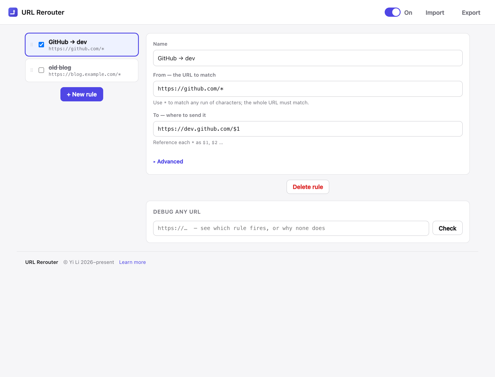
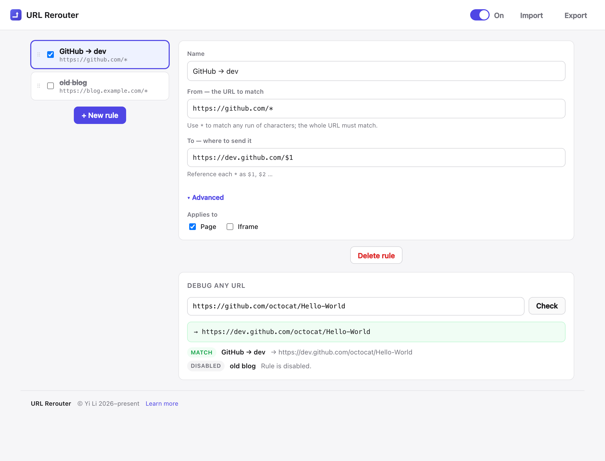

# URL Rerouter

A tiny Chrome (MV3) extension that redirects URLs with simple wildcard rules — and lets you
**check exactly what a rule does before you rely on it**. No save-and-pray like the original
Redirector.



## What it does

- **Wildcard redirect rules.** Write a `From` pattern with `*` and a `To` target with `$1`,
  `$2`, … Example: `https://github.com/*` → `https://dev.github.com/$1`.
- **Debug any URL.** Paste a URL and see which rule fires and where it lands — or exactly why
  none does (no match / disabled / shadowed by a higher rule). This is the testing loop: you
  confirm a rule before trusting it instead of guessing.
- **Priority by order.** Drag rules to reorder them; the topmost matching rule wins.
- **Per-rule scope.** Under **Advanced**, choose whether a rule applies to top-level pages,
  iframes, or both.
- **Import / Export.** Back up or share your rules as JSON.
- **On/off in one click.** The toolbar popup is a global switch with a live count of active
  rules.
- **Minimal + small.** Pure static MV3 files — no backend, no build step, no framework. The
  packaged extension is ~50 KB.

### What you debug is what ships

The **Debug any URL** panel and the installed redirect run the *same* compiler
(`src/compile.js`). Each rule compiles to a `declarativeNetRequest` dynamic rule
(`regexFilter` + `regexSubstitution`), and a conformance test proves the regex we emit matches
URLs **identically** under real RE2 (the engine Chrome uses) and the JS `RegExp` the debugger
uses — so the debugger's verdict is the production verdict.



## Pattern syntax

- `*` in the **From** pattern matches any run of characters and is captured.
- Reference captures in the **To** target as `$1`, `$2`, … (up to `$9`). Use `$$` for a literal `$`.
- The whole URL must match (patterns are anchored). Matching is case-sensitive.
- Example: `https://reddit.com/*` → `https://old.reddit.com/$1`.

> Redirects compile to RE2 (Chrome's `declarativeNetRequest` engine), so there are no
> backreferences or lookarounds — but for URL→URL redirects that covers what Redirector is
> actually used for.

## Install (load unpacked)

1. Download or clone this repo.
2. Open `chrome://extensions` → enable **Developer mode** → **Load unpacked** → pick this folder.
3. Open the extension's **Options** to manage rules; the toolbar popup is the global on/off.

## Develop

```sh
npm install      # playwright (for gates) + re2-wasm (for conformance)
npm test         # unit tests + RE2 conformance (no browser needed)
npm run test:ui  # drives the real UI in chromium + refreshes docs/screenshots
npm run package  # build dist/reroute-v<version>.zip for the Chrome Web Store
```

Tests:

- `test/compile.test.mjs` — the wildcard compiler/matcher (escaping, captures, `$n`
  substitution, anchoring, priority resolution).
- `test/conformance.test.mjs` — the "what you debug is what ships" proof: the emitted regex
  matches URLs identically under real RE2 (`re2-wasm`) and the JS `RegExp` the debugger uses.
- `test/ui.mjs` — drives the actual editor and reverse debugger in chromium.
- `test/browser.mjs` — a live gate that loads the unpacked extension and asserts a real
  navigation is redirected end to end (desktop only; see the note below).

> Note: Chrome 137+ ignores the old `--load-extension` switch, and under Playwright's
> Chrome-for-Testing a CDP-loaded extension loads but stays inert (no service worker, pages
> blocked, DNR rules don't fire), so `npm run test:browser` can't drive it everywhere. To
> verify a live redirect, use the **Load unpacked** steps above in regular Chrome.

## License

MIT — see [LICENSE](LICENSE).
