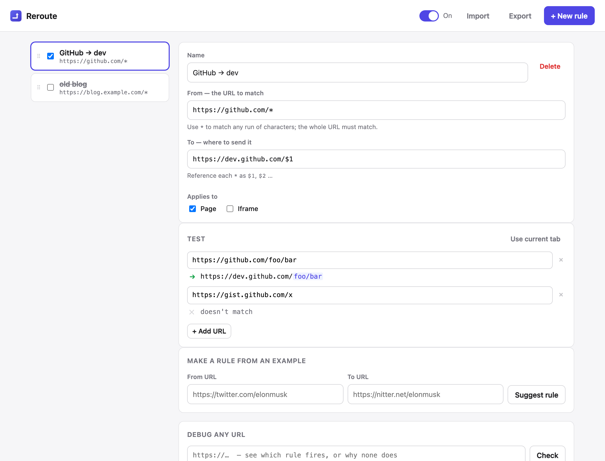

# Reroute

A tiny Chrome (MV3) extension that redirects URLs with simple wildcard rules — and lets
you **actually test a rule against example URLs before you save it**. That testing loop is
the whole point: no more save-and-pray like the original Redirector.



## What makes it different

- **Live preview through the same engine that ships.** As you type a rule, every example
  URL shows the exact resulting redirect, with the captured `*` segments highlighted. The
  preview and the installed rule run the *same* compiler (`src/compile.js`), so what you see
  is what happens.
- **Multi-URL test table + "use current tab".** Paste several URLs (or grab the active
  tab's) and watch which match and where they land — catch over-matching instantly.
- **Reverse debugger.** Paste any URL and see which rule fires, or exactly why none does
  (no match / disabled / shadowed by a higher rule).
- **Make a rule from an example.** Paste a before-URL and an after-URL; Reroute drafts the
  wildcard rule for you (and generalizes the common "mirror this site" case).
- **Minimal + small.** Pure static MV3 files, no backend, no build step, no framework.
  The packaged extension is ~50 KB.

## Pattern syntax

- `*` in the **From** pattern matches any run of characters and is captured.
- Reference captures in the **To** target as `$1`, `$2`, … (up to `$9`).
- The whole URL must match (patterns are anchored). Matching is case-sensitive.
- Example: `https://github.com/*` → `https://dev.github.com/$1`.

Under the hood each rule compiles to a `declarativeNetRequest` dynamic rule
(`regexFilter` + `regexSubstitution`). DNR uses RE2, so there are no backreferences or
lookarounds — but for URL→URL redirects that covers what Redirector is actually used for.

## Develop

```sh
npm install            # playwright (for gates) + re2-wasm (for conformance)
npm test               # unit + RE2 conformance (no browser needed)
npm run test:ui        # drives the real UI in chromium + refreshes doc/screenshots
npm run test:browser   # LIVE redirect gate — run on a desktop (see note below)
npm run package        # build dist/reroute-v<version>.zip for the Web Store
```

### Load it unpacked

1. `chrome://extensions` → enable **Developer mode** → **Load unpacked** → pick this folder.
2. Open the extension's **Options** to manage rules; the toolbar popup is the global on/off.

> Note: Chrome 137+ ignores the old `--load-extension` switch, and under Playwright's
> Chrome-for-Testing a CDP-loaded extension loads but stays inert (no service worker, pages
> blocked, DNR rules don't fire), so `npm run test:browser` can't drive it. Verify the live
> redirect with the manual load above in **regular Chrome** — that's the reliable check.
> `npm test` + `npm run test:ui` cover everything else automatically.

## Tests / guarantees

- `test/compile.test.mjs` — the wildcard compiler/matcher (escaping, captures, `$n`
  substitution, anchoring, priority resolution).
- `test/conformance.test.mjs` — proves the regex we emit matches URLs **identically** under
  real RE2 (`re2-wasm`, the engine DNR uses) and under the JS `RegExp` the preview uses.
  This is the "preview == production" proof for the pattern subset.
- `test/infer.test.mjs` — the example→rule inference round-trips.
- `test/ui.mjs` — drives the actual editor/tester/inference/debugger in chromium.
- `test/browser.mjs` — the live gate: loads the unpacked extension and asserts a real
  navigation is redirected end to end (desktop only).

## Status

v0.1.0. Built; unit + conformance + UI gates green. The live in-Chrome redirect needs a
30-second manual load in regular Chrome (see `AWAY_LOG.md` — automation can't drive a
CDP-loaded extension here). Deferred for later: Redirector JSON import, per-rule exclude
patterns, raw-regex advanced mode.
