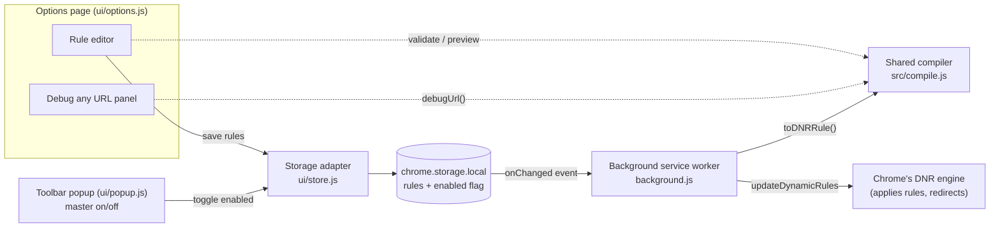
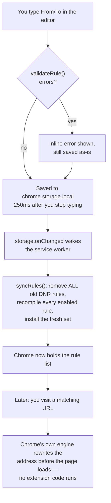
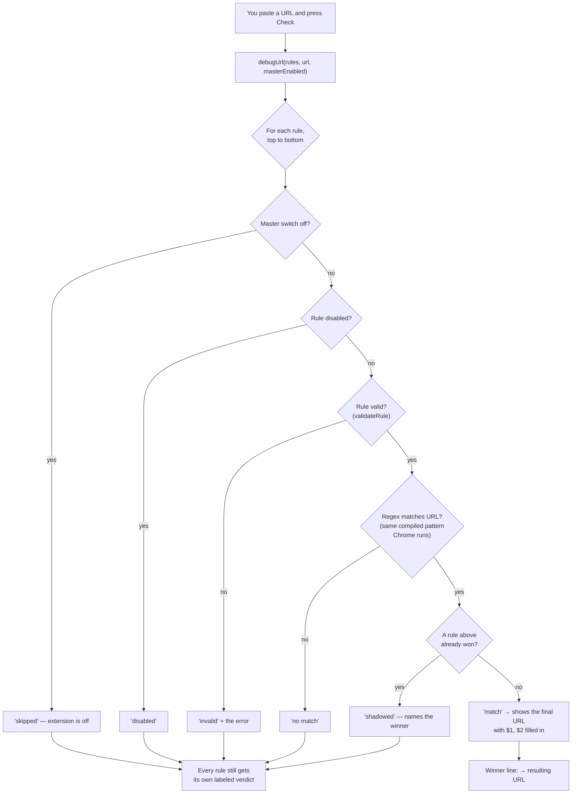

# How URL Rerouter Works

## What it is

URL Rerouter is a small add-on for the Chrome web browser that automatically sends you from one web address to another. You write a rule like "whenever I open `https://reddit.com/anything`, take me to `https://old.reddit.com/anything` instead," and from then on the browser does the swap for you before the page even loads. It's built for people who used the classic "Redirector" extension (a popular older redirect add-on) but were tired of one thing: saving a rule and *hoping* it works. Here you can paste any web address into a built-in "Debug any URL" box and see which rule would fire — or, rule by rule, why none does — before you trust it.

## The words you need, defined once

- **URL** — a web address, like `https://github.com/torvalds/linux`. "Redirecting" a URL means the browser goes to a different address than the one you asked for.
- **Chrome extension** — a small program you install *into* the Chrome browser. It can't do anything on its own; it asks the browser for specific abilities (called *permissions*) and the browser enforces the limits.
- **Manifest V3 (MV3)** — the current rulebook Chrome makes extensions follow. Every extension ships a file called `manifest.json` (a "manifest" is literally a packing list: name, version, which abilities it needs, which files do what). "V3" is the third version of that rulebook, and its big idea is: extensions should *declare* what they want done rather than run code with their hands in every page.
- **declarativeNetRequest (DNR)** — the MV3 feature this whole extension is built on. Break the name apart: *net request* = the browser asking the internet for a page; *declarative* = you hand Chrome a written list of rules ("if the address looks like X, send it to Y") instead of running your own code on each request. Think of it as filling out a form for the post office — "forward my mail from this address to that one" — versus standing at your mailbox intercepting every letter yourself. The post office (Chrome) does the forwarding; you don't even need to be awake. This is faster (no extension code runs per page load) and more private (the extension never sees your traffic — Chrome just applies the list).
- **Regular expression (regex)** — a compact pattern language for matching text. `^https://a\.com/(.*)$` means "text that starts with `https://a.com/` and then anything, which we remember." The parentheses are a **capture group**: whatever they matched gets saved so it can be reused. Regexes are powerful but fiddly — which is exactly why this extension doesn't make *you* write them.
- **RE2** — the specific regex engine Chrome's DNR uses internally (an "engine" is the program that actually runs a regex against text). RE2 deliberately supports slightly fewer regex features than JavaScript's built-in `RegExp` so it can guarantee fast matching. This matters later: two different engines evaluate this extension's patterns, and they must agree.
- **Wildcard** — the `*` character, meaning "any run of characters, including nothing." Much friendlier than regex: `https://github.com/*` reads exactly like what it does.

## The rule model

A rule is a tiny object (see how the editor creates one in `ui/options.js`, `newRule()`):

```
{ id, name, enabled, from, to, resourceTypes }
```

- `from` — a wildcard pattern the *whole* URL must match, e.g. `https://github.com/*`.
- `to` — where to send it, e.g. `https://dev.github.com/$1`. Each `*` in `from` is numbered left to right; `$1`, `$2`, … (up to `$9`) paste in what that `*` matched. `$$` means a literal dollar sign.
- `enabled` — a per-rule on/off switch (there's also one global master switch).
- `resourceTypes` — under "Advanced": apply to top-level pages (`main_frame`), iframes — pages embedded inside other pages (`sub_frame`) — or both. Default is pages only.

Rules live in an ordered list, and **order is priority**: the topmost rule that matches a URL wins. You drag rules to reorder them.

All rules are saved in `chrome.storage.local` — a small private notepad Chrome gives each extension for saving its settings (a *key-value store*: named slots you write values into). It lives only on your device; nothing is sent anywhere, and the extension has no server.

## The parts, and how they talk

There are five small pieces:

1. **The options page** (`ui/options.html` + `ui/options.js`) — the rule editor, the drag-to-reorder list, import/export, and the "Debug any URL" panel.
2. **The shared compiler** (`src/compile.js`) — a *compiler* is a program that translates one language into another; this one translates friendly wildcard rules into the regex form Chrome needs. It also validates rules and can evaluate them against a URL. One file, imported everywhere the translation is needed.
3. **The background service worker** (`background.js`) — a short script Chrome wakes up when needed (that's what a *service worker* is: code with no window of its own that runs on events, then goes back to sleep). Its only job: whenever the saved rules change, recompile them all and hand the result to Chrome's DNR engine.
4. **The toolbar popup** (`ui/popup.js`) — the global on/off switch, plus a count of enabled rules taken when you open it.
5. **The storage adapter** (`ui/store.js`) — a thin wrapper both UI pages use to read and write the saved state, so neither talks to `chrome.storage.local` directly.



Notice: the options page never talks to Chrome's redirect engine directly — it only writes storage, and *both* the debugger and the background worker import the same `src/compile.js`.

The key design line is in `background.js`'s header comment: *the options page never touches DNR directly — it only writes storage; the worker is the single place that compiles and installs rules.* That gives the system one funnel, so there's exactly one code path that can affect what Chrome enforces.

## The core loop: you write a rule, the browser redirects



Notice: after step F the extension could be asleep or even crash — redirects keep working, because Chrome itself holds the rules.

Details worth knowing (all in `background.js`):

- **Rebuild, don't patch.** `syncRules()` never edits individual installed rules; it asks Chrome to remove the old set and install the fresh one in a single all-or-nothing operation. Rebuilding from scratch every time means there's no bookkeeping that can slowly go stale.
- **Priority is explicit.** List position `i` becomes DNR priority `rules.length - i`, so the top of the list gets the biggest number (in DNR, a higher number wins). That's how "topmost rule wins" survives the trip into Chrome.
- **Rules the editor can catch can't break the rest.** A rule that fails the extension's own validation is skipped with a console warning; the editor is where you see its errors. (Limits only Chrome knows about — such as its cap on the number and size of regex rules — are a different story: because the install is all-or-nothing, a rule Chrome itself rejects makes the whole update fail and the previously installed set stays in place. With a handful of hand-written rules you won't hit those caps.)
- **Master off = empty list.** Flipping the popup switch off installs zero rules, pausing everything.

## The hard part: one compiler, two engines

Here's the trap this project is built to avoid. The wildcard pattern must become a regex for Chrome's DNR engine, which runs **RE2**. But the "Debug any URL" panel runs in a normal web page, where the only regex engine available is JavaScript's **RegExp** — a *different* engine with different features. If the debugger evaluated rules one way and Chrome another, the debugger would sometimes lie: "this will redirect" when it won't. The entire value of the tool would be gone.

The fix has three layers.

**Layer 1 — one compiler.** `src/compile.js` is imported by both the background worker and the options page. `wildcardToRegex()` is deliberately simple: split the pattern on `*`, escape every regex-special character in the literal chunks (so a `.` or `?` in your URL means a real dot or question mark, not regex magic), rejoin with `(.*)` capture groups, and anchor with `^`/`$` so the whole URL must match:

```
https://a.com/*/issues/*   →   ^https://a\.com/(.*)/issues/(.*)$
```

For the `to` side, `toRegexSubstitution()` converts your `$1` into `\1`, the format DNR wants, and turns `$$` into a literal `$`.

**Layer 2 — stay inside the overlap.** The compiler only ever emits `^`, `$`, escaped literals, and `(.*)` — pattern pieces that mean the same thing in RE2 and JavaScript RegExp. Features that exist in one engine but not the other — like *backreferences* ("match the same text again that group 1 matched") and *lookarounds* ("match only if something comes before/after"), both of which RE2 refuses on purpose — can never appear, because the compiler never writes them. This is the real reason the rules are wildcard-only: a hand-written regex field would let users write patterns the two engines disagree on, and the preview could no longer be trusted. Wildcards trade a little power for a preview the project can actually test — and for URL-to-URL redirects, wildcards cover what people actually do.

**Layer 3 — test it.** `test/conformance.test.mjs` runs every emitted regex against 170 pattern/URL pairs (10 tricky patterns × 17 URLs) under *real RE2* (via the `re2-wasm` package) and under JS `RegExp`, and asserts both engines agree on the match decision *and* on every captured group. A second test checks the `to`-side substitution without circular logic: it applies the DNR-format `\n` string using a small, independently written interpreter of Chrome's substitution format, and asserts the result equals what the preview computes — so both substitution code paths are checked against a third opinion rather than against each other. If a change to the compiler ever made the two engines disagree, `npm test` fails.

**Where the guarantee currently stops.** Honesty requires listing what the shared compiler does *not* cover, because Chrome adds behavior around the regex itself:

- **Letter case.** The preview matches case-sensitively (`Reddit.com` is not `reddit.com`). But since Chrome 118, DNR treats a rule's pattern as case-*insensitive* unless the rule explicitly says otherwise — and the compiled rules don't set that flag (`toDNRRule()` in `src/compile.js` emits no `isUrlFilterCaseSensitive`). So a URL that differs from your pattern only in capitalization can be redirected by Chrome while the debugger reports "no match." The conformance test can't see this, because it compares regex engines, not Chrome's rule settings.
- **Page vs. iframe scope.** `debugUrl()` checks only the URL; it ignores a rule's "Applies to" setting. A rule scoped to iframes only can show up as the debugger's winner even though Chrome would never apply it to a page you navigate to.
- **Install-time failures.** If Chrome rejects a rule update (see the limits note above), the debugger still reasons about the rules as saved, not as installed.

These are edges of the current implementation, not the common path — for ordinary lowercase URL-to-URL rules applied to pages, the debugger's verdict and Chrome's behavior line up, and the test suite keeps the compiler itself honest.

The debugger itself is `debugUrl()` in `src/compile.js`: it walks the rule list top to bottom, evaluating each rule's compiled pattern against your URL, and records a verdict per rule — so instead of a silent "nothing happened," you see *why*.



Notice: the debugger never answers just "no" — every rule in the list gets one of six labeled verdicts, so "why didn't this redirect?" always has a concrete answer.

## Why it's built this way — the short list

- **DNR instead of intercepting requests in code**: Chrome applies the rules itself, so redirects work even while the extension sleeps, no extension code runs per page load, and the extension never sees your browsing. (Under MV3 this is also essentially the only option — the old "run code on every request" approach was removed.)
- **Wildcard-only patterns**: keeps every emitted regex inside the RE2/JavaScript overlap, which is what makes an honest preview *possible* — and `*` plus `$1` is all a URL redirect realistically needs.
- **One shared compiler**: the preview and the installed rules come from the same translation code, so they can't disagree about what a pattern means; the conformance test then checks the remaining engine gap. (The "where the guarantee stops" list above is what's left.)
- **Storage as the only channel**: UI writes storage, worker reads storage. One direction, one funnel — there is exactly one code path that decides what Chrome enforces.
- **Full rebuild on every change**: with a handful of rules, wiping and reinstalling is trivially cheap and eliminates an entire class of "stale rule" bugs.
- **No build step, no framework**: there is no compile-the-project step and no UI library — the files in the repo are the files Chrome runs, byte for byte (plain JavaScript modules; the whole packaged extension zips to about 23 KB).

## Storage, privacy, and the fallback trick

Everything lives in `chrome.storage.local` under two keys: `rules` (the ordered list) and `enabled` (the master switch). Nothing ever leaves your machine — there's no server, no analytics, no network calls. The scary-sounding `<all_urls>` permission in the manifest exists only so your rules are *allowed* to match any site; the extension doesn't read page content (it can't — none of its code runs inside pages).

One neat detail in `ui/store.js`: if the options page is opened as a plain web page *outside* Chrome's extension context, storage transparently falls back to the page's `localStorage`. That lets the whole editor and debugger run — and be tested by automated browser tests (`test/ui.mjs`) — without installing the extension at all.

## How it's installed and distributed

- **Load unpacked (today's path):** clone the repo, open `chrome://extensions`, turn on *Developer mode*, click *Load unpacked*, pick the folder. Chrome runs the source files directly.
- **Chrome Web Store package:** `npm run package` (`tools/package.mjs`) zips just the runtime files — `manifest.json`, `background.js`, `src/`, `ui/`, `icons/` — into `dist/reroute-v<version>.zip`, the file the Web Store accepts. Store listing copy and marketing images live in `store-assets/`.
- **Tests before shipping:** `npm test` runs the compiler unit tests plus the RE2 agreement suite (no browser needed); `npm run test:ui` drives the real editor and debugger in an automated copy of the browser (Chromium). A final "Chrome actually redirected a real navigation" check exists in `test/browser.mjs`, but it only works in a full, visible desktop Chrome — under the automated test browser, a programmatically loaded MV3 extension loads but stays inert — so in practice that last check is done by hand with a load-unpacked install. Note that packaging doesn't run the tests for you; you run `npm test` yourself before `npm run package`.
